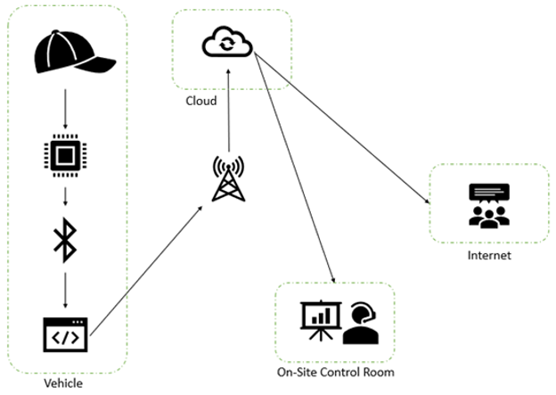

# IoT-based-Drowsiness-Detection-System (Capstone Project)
A drowsiness detection sysyem based on processing electroencephalogram(EEG) data using FFT technique and a linear algorithm to compute Power Spectrum Density to identify the status of a driver. The system is capable of operating both in local and onlone modes and alert the driver with a Audio-Visual feedback to prevent accidents. 

<table align="center">
  <tr align="center"><td></td></tr>
</table>

<h1>1. Hardware</h1>
<ul type ="disk">
  <li>A non-invasive commerical bluetooth EEG sensor </li>
  <li>An industrial grade tablet running on Windows 10 IoT Enterprise</li>
  <li>A headband for mounting the sensor with a set of dry electrodes</li>
</ul>
<table>
  <tr align="center"><td>  </td> <td>  </td></tr>
</table>

<h2> Sensor Location </h2>
<table align="center">
  <tr><td>  </td></tr>
</table>

<h1>2. Software</h1>
<ul type="disk">
  <li>.Net Framework, C#</li>
  <li>Microsoft Azure (Event Hub, Stream Analytics)</li>
  <li>Microsoft Power Bi (Data Visualization) </li>
</ul>

<h1>3. System Overview</h1>
<table>
  <tr><td></td></tr>
</table>
(1) Sensor (headset + EEG sensor)  
(2) Tablet running on Windows 10 IoT Enterprise OS (Local Mode)  
(3) Azure + Power Bi (Online Mode)  

<H2> 3.1 FFTW Wrapper - libfftw3-3.dll </H2>
FFTW is a C subroutine library for computing the discrete Fourier transform (DFT) in one or more dimensions, of arbitrary input size, and of both real and complex data. 

FFTW wrapper written by Tamas Szalay: 
https://github.com/tszalay/FFTWSharp/tree/master/FFTWtest 
 
FFTW Original SOurce: 
http://www.fftw.org/download.html 
